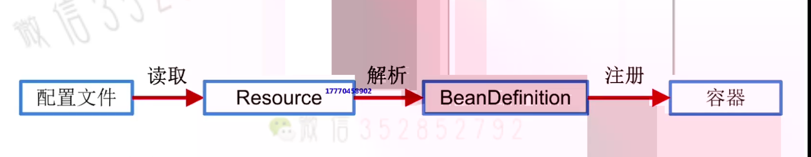

# Bean 与 BeanDefinition
## Bean
1. Bean是Spring中的一等公民
2. Bean的本质就是Java对象，只是这个对象的生命周期由容器来管理
3. 不需要为了创建Bean而在原来的java类上添加任何额外限制
4. Spring对Java对象的控制方式体现在配置上
     - Spring会根据配置(配置文件、注解等方式),生成用来描述Bean的BeanDefinition。
         - Java中会使用java.lang.Class来描述对象,而Spring中则是使用BeanDefinition来描述Bean
## 容器初始化主线
1. 配置文件(xml配置文件或者注解)读取
2. 读取配置文件之后,在内存中形成一个个Resource对象
3. 将Resource文件解析为BeanDefinition对象
4. 将BeanDefinition注册到容器中
- 