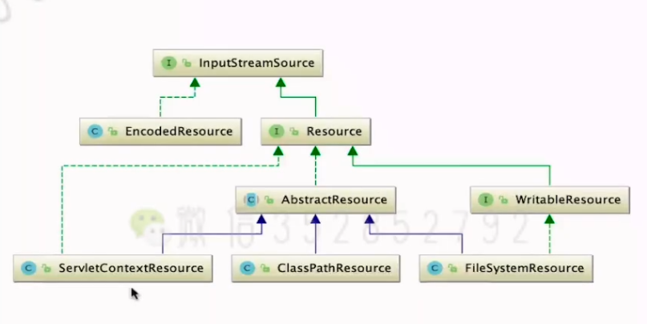

# Resource
## 背景
+ Spring将对物理资源的访问方式抽象为Resource(spring-core\src\main\java\org\springframework\core\io\Resource.java)
+ Resource是Spring资源访问的抽象，他本身并不提供任何访问资源的实现，具体的资源访问的实现由其实现类来实现，每个实现类提供了对一类资源的访问方式.
+ 

## 强大的资源方式
+ 自动识别"classpath:" 、 "file:"等资源地址前缀
+ 支持自动解析Ant风格带通配符的资源地址