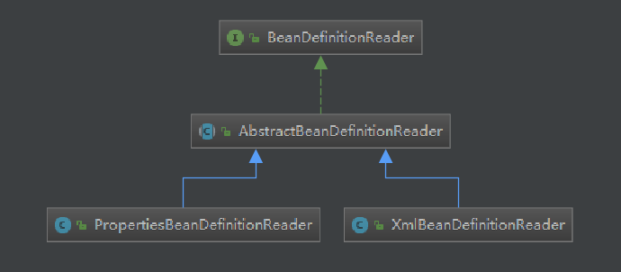

# BeanDefinition && BeanDefinitionReader
## 相关的类或接口
+ BeanDefinition
+ BeanDefinitionReader
+ BeanDefinitionRegistry
-----------------
## BeanDefinition
### 什么是BeanDefinition
+ org.springframework.beans.factory.support.AbstractBeanFactory#getMergedBeanDefinition(java.lang.String, org.springframework.beans.factory.config.BeanDefinition, org.springframework.beans.factory.config.BeanDefinition)
   - 为什么要将GenericBeanDefinition转为RootBeanDefinition?
--------------------
## 继承关系图
### 01.BeanDefinitionReader
+ 
#### AbstractBeanDefinitionReader
## BeanDefinitionRegistry