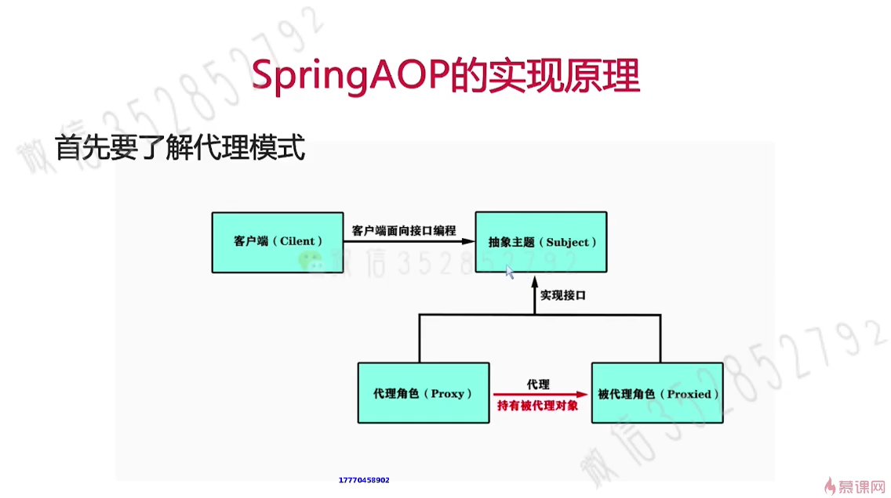
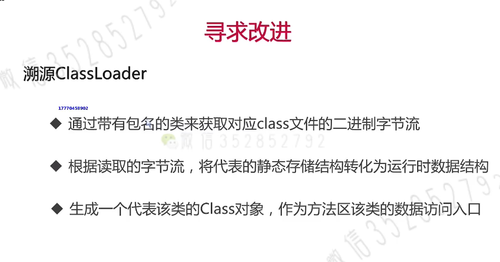
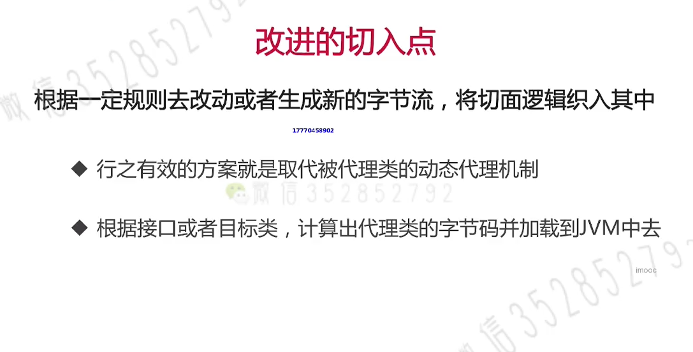
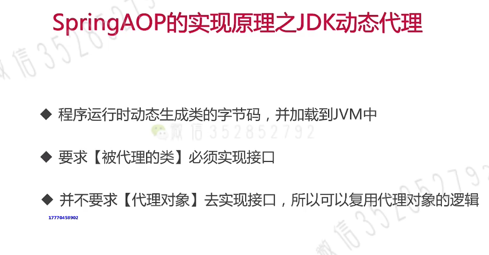

# Spring AOP实现原理
## 01. 代理模式
+ 
+ 
+ 计算出代理类的字节码并加载到JVM中
   - 
## 02. JDK动态代理
&nbsp;&nbsp;JDK动态代理由JDK提供,详见:java.lang.reflect.Proxy.newProxyInstance
+ 
## 03. CGLIB动态代理
&nbsp;&nbsp;CGLIB动态代理里面是封装了ASM Java字节码操作框架,会对动态生成子类覆盖父类的非final方法,绑定钩子回调自定义拦截器
+ 

